# AI Research Workflow Skills

一套面向深度学习科研的 AI 辅助研究工作流 skills，适配 Claude Code、OpenAI Codex CLI 和 OpenCode。

## 灵感来源

- [AI科研不完全指北：Top10 PhD烧了上万刀的真实经验。 Context Is All You Need](https://linux.do/t/topic/1969598)
- [AI 科研不完全指北第二期：如何Propose一个idea](https://linux.do/t/topic/2005563)

核心论点：**Context Is All You Need。** 被污染的上下文会崩溃式地影响模型能力。整个工作流的所有设计决策，背后都只在做一件事：管住每一个 session 的上下文。

本项目由 Claude Code + GLM-5.1 协作实现。

---

## 整体架构

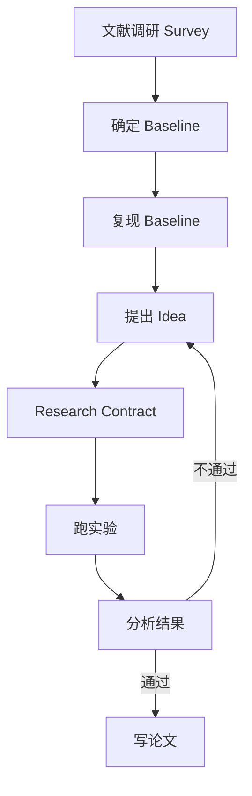

## 工作流阶段

| 阶段 | 命令 | 说明 | 核心产出 |
|------|------|------|----------|
| 1 | `/research-survey` | 文献调研 | 结构化综述文档 |
| 2 | `/research-baseline` | 确定 baseline | 任务设定 + baseline 规格 |
| 3 | `/research-reproduce` | 复现 baseline | 验证后的指标 + 干净的环境路径 |
| 4 | `/research-idea` | 提出并评估 idea | 排序后的 idea cards |
| 5 | `/research-contract` | 写研究合约 | 不可变的实验合约 |
| 6 | `/research-experiment` | 跑实验 | 实验结果 + 原始数据 |
| 7 | `/research-analyze` | 分析结果 | 逐信号评估报告 |
| 8 | `/research-write` | 写论文 | 论文草稿 |

阶段 4-7 是迭代循环。好的 idea 从实验信号中生长出来，不要指望一次就完美。

---

## 上下文管理架构

这是整个工作流最核心的设计。每个阶段的上下文必须严格隔离：

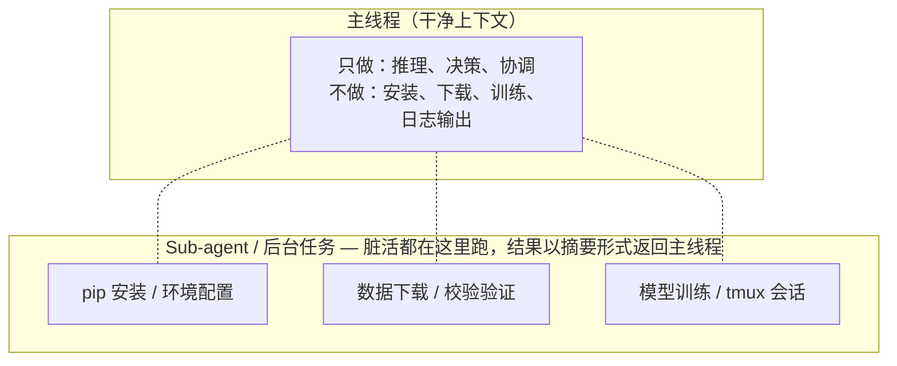

**规则：如果模型反复修不好一个 bug，不一定是它没能力，而是上下文已经被彻底带偏了。重开一个干净的 session。**

---

## Research Contract 机制

合约是整个实验阶段的唯一准绳，防止事后合理化：

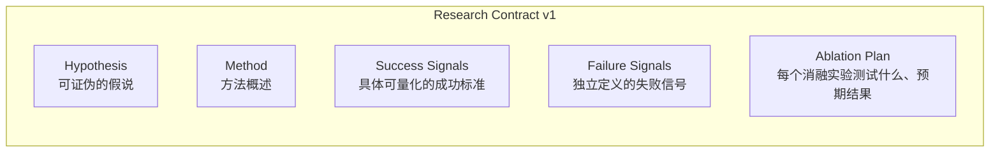

时间线：

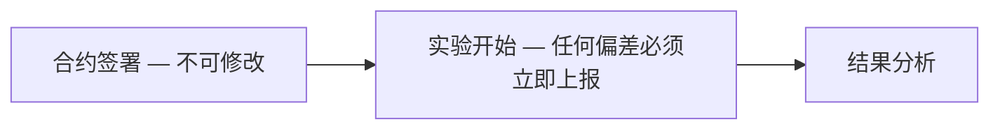

⚠️ 实验开始后不可修改，只能版本升级（v1 → v2）

### 合约完整性校验

实验开始时自动锁定合约，防止事后篡改：

```
.research/                   ← 自动创建，加入 .gitignore
  contracts/
    v1.lock.md               ← 实验开始时的合约快照
  v1.sha256                  ← SHA256 校验值
```

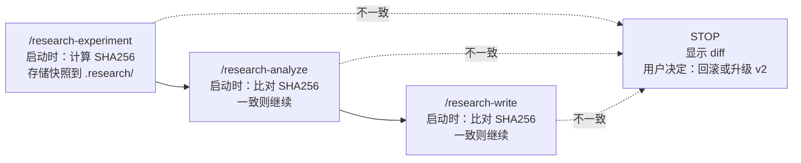

所有操作仅使用 POSIX 标准工具（`sha256sum`、`awk`、`diff`），无需额外依赖。

---

## 多模型协作架构

不同模型有不同优势，整个工作流利用模型间的 ensemble 效应：

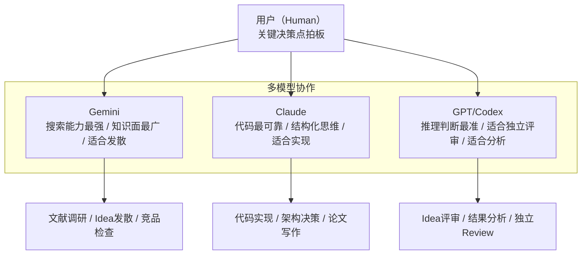

协作流程（以 Idea 阶段为例）：

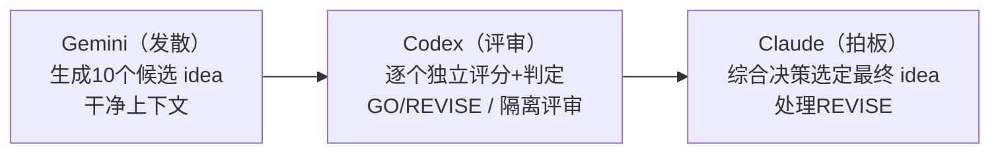

---

## 核心原则

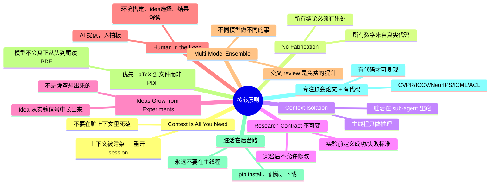

---

## 典型工作流

### 工作流 A：从零开始的新项目

最常见的场景：你对一个方向感兴趣，但还没有明确的 idea 和代码。

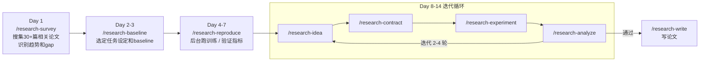

**操作示例（Claude Code）：**

```bash
# Day 1: 调研
/research-survey
> 研究方向：3D点云目标检测中的高效特征提取方法

# Day 2: 确定 baseline
/research-baseline
> 基于 survey 结果，选定 PointNeXt (CVPR 2023) 作为 baseline

# Day 4: 复现（在新的干净 session 中）
/research-reproduce
> Baseline: PointNeXt, 数据集: ScanNet, 指标: mAP@0.5

# Day 8: 开始迭代
/research-idea
> 基于 survey + 复现结果生成候选 idea

# 选定 idea 后
/research-contract
> 为选定的 idea 写合约

# 合约确认后
/research-experiment
> 严格按合约跑实验

# 实验完成后
/research-analyze
> 逐信号评估

# 如果通过
/research-write
> 写论文草稿
```

---

### 工作流 B：在已有项目上迭代改进

你已经有一个 running pipeline，想进一步提升性能或尝试新方向。

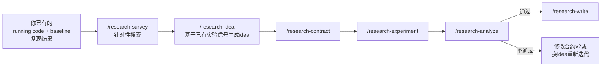

**关键区别：**
- 跳过 baseline 确定和复现阶段（你已经有）
- survey 阶段更有针对性：搜索当前方法没能覆盖的相关工作
- idea 阶段可以利用已有实验的失败信号作为上下文

**操作示例：**

```bash
# 在你已有的项目目录中启动新 session
# 直接告诉 AI 你当前的状况：
/research-idea
> 我目前 follow 了一篇 CVPR 2026 的论文，在 ScanNet 上
> 复现了他们的结果（mAP=63.2），尝试加 attention module
> 后提升到 65.1，但训练不稳定，loss 在 epoch 80 后开始抖动。
> 请基于这些信号生成改进 idea。

# 或先做针对性调研
/research-survey
> 搜索：3D目标检测中解决训练不稳定的方法，以及
> attention module 在点云特征提取中的最新工作

# 然后走合约 → 实验 → 分析的流程
```

---

### 工作流 C：探索式研究（无明确 baseline）

你想进入一个新领域，还没有明确的目标论文和 baseline。

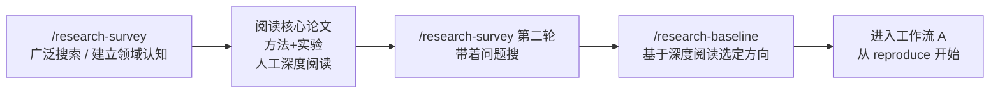

**关键区别：**
- 两轮 survey：第一轮广泛扫描建立认知，人工深度阅读 3-5 篇核心论文，第二轮带着具体问题搜索
- Human in the loop 更重：你需要自己读论文的关键细节（作者遇到的困难、决策过程），这些信息 AI 很难直接获取
- baseline 选择更谨慎：你对领域的理解决定了 baseline 的质量

**操作示例：**

```bash
# 第一轮：广泛扫描
/research-survey
> 研究方向：图神经网络在分子性质预测中的应用

# ... 人工阅读 survey 推荐的 top 3-5 论文 ...

# 第二轮：带着问题搜索
/research-survey
> 基于我对 SchNet 和 DimeNet 的阅读，它们在处理
> 长程分子相互作用时有明显局限。搜索：
> 1. 解决长程相互作用的 GNN 方法
> 2. 等变神经网络在分子预测中的最新进展
> 3. 3D分子表示学习中 position encoding 的新方法

# 确定 baseline
/research-baseline
> 基于我的阅读和第二轮 survey，选定 EquiformerV2
> (ICLR 2024) 作为 baseline

# 之后进入工作流 A 的 reproduce 阶段
```

---

### 工作流 D：快速验证一个 idea（最轻量）

你已经有一个明确的 idea，只想快速验证可行性，不需要完整的论文产出。

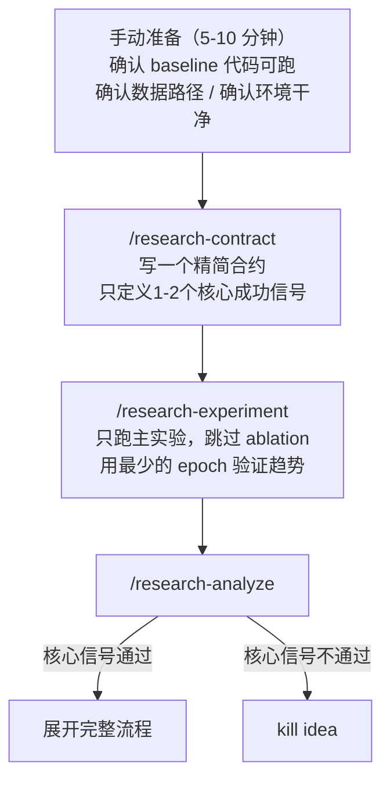

**关键区别：**
- 手动准备环境，避免 AI 环境搭建的上下文污染
- 精简合约，快速验证
- 只跑主实验，不做 ablation
- 如果信号 positive，再回到工作流 A/B 展开完整流程

---

### 工作流选择指南

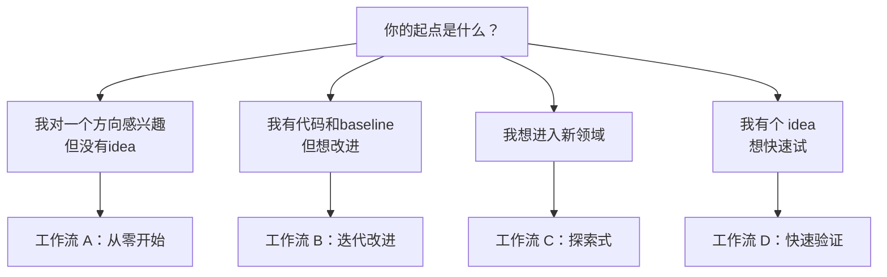

---

## 部署方式

### Claude Code

```bash
cp -r claude-code/.claude /your/project/
```

在项目中创建 `.claude/commands/research-*.md`，通过 `/research-survey`、`/research-baseline` 等调用。

### OpenAI Codex CLI

```bash
cp codex/AGENTS.md /your/project/
cp -r codex/.agents /your/project/
```

Codex 自动发现 `.agents/skills/research-*/SKILL.md`。

### OpenCode

```bash
cp opencode/AGENTS.md /your/project/
cp -r opencode/.opencode /your/project/
```

OpenCode 也兼容 Claude Code 模式，可以直接用 Claude Code 的 commands：

```bash
cp -r claude-code/.claude /your/project/
```

### 文件结构对比

**Claude Code：**

```
.claude/commands/
  ├── research-survey.md      ← slash command
  ├── research-baseline.md
  ├── research-reproduce.md
  ├── research-idea.md
  ├── research-contract.md
  ├── research-experiment.md
  ├── research-analyze.md
  └── research-write.md
```

**Codex CLI：**

```
AGENTS.md                    ← 跨切面原则
.agents/skills/
  ├── research-survey/SKILL.md
  ├── research-baseline/SKILL.md
  ├── ...
  └── research-write/SKILL.md
```

**OpenCode：**

```
AGENTS.md                    ← 跨切面原则
.opencode/skills/
  ├── research-survey/SKILL.md
  ├── research-baseline/SKILL.md
  ├── ...
  └── research-write/SKILL.md
```

---

## 阶段间依赖关系

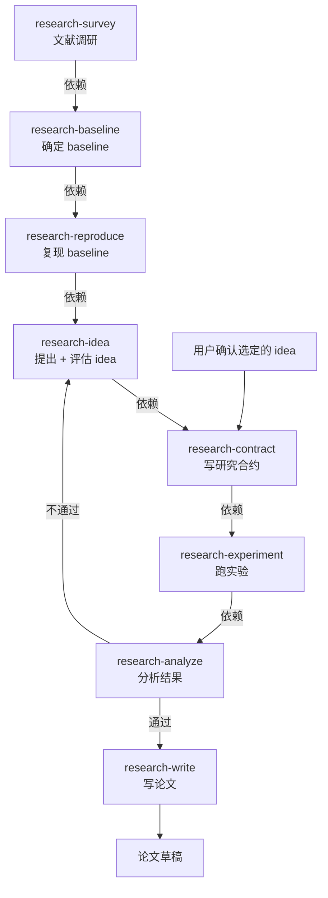
